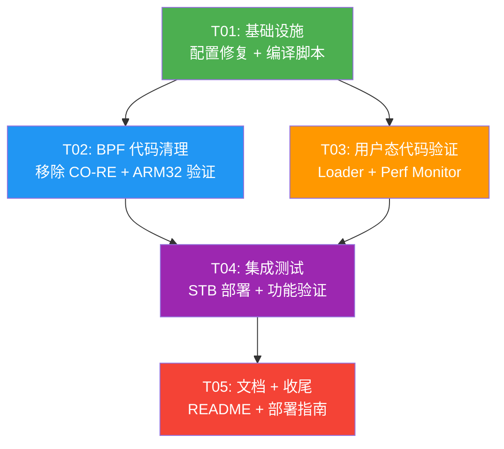

# STB eBPF 探针无 BTF 内核兼容改造 — 系统架构设计

> **项目**: `stb_ebpf_probe_compat`  
> **编程语言**: C (BPF + libbpf, 静态编译, no-CO-RE)  
> **目标设备**: STB 机顶盒 (ARM32 架构, Linux 5.4.210 内核, 无 BTF 支持)  
> **架构师**: 高见远 (Bob)  
> **版本**: v1.0 (PRD 兼容改造版)  
> **日期**: 2026-06-24  

---

## Part A: 系统设计

---

### 1. 实现方案

#### 1.1 核心挑战分析

| 挑战 | 当前状态 | 应对策略 |
|------|----------|----------|
| ❌ CO-RE 依赖残留 | `stb_connect.bpf.c` 第 17 行仍包含 `<bpf/bpf_core_read.h>` | **移除 CO-RE include**，验证无 `BPF_CORE_READ` 调用 |
| ✅ ringbuf → perf buffer | 代码已使用 `BPF_MAP_TYPE_PERF_EVENT_ARRAY` | **无需修改**，已在 vmlinux_legacy.h 中正确实现 |
| ⚠️ ARM32 架构适配 | `connect_event_t` 已 packed，但需验证 | **验证结构体对齐**，确保指针用 `__u32`，时间戳用 `__u64` |
| ⚠️ 指令数限制 (4096) | 当前 `stb_connect.bpf.c` 指令数未知 | **验证并优化**，必要时拆分 BPF 程序 |
| ⚠️ 配置错误 | `config.h` 中 `RELAY_SERVER_IP` 为 `10.115.107.91` | **修改为 `192.168.58.130`** (PRD P0-5) |
| ⚠️ 交叉编译脚本 | `scripts/build_arm.sh` 存在但需简化 | **创建 `build_arm32.sh`** (PRD P0-6) |

#### 1.2 技术选型

| 组件 | 选型 | 版本要求 | 理由 |
|------|------|----------|------|
| **BPF 编译** | Clang/LLVM | ≥ 14.0 | 支持 `-target bpf`，生成 BPF 字节码 |
| **用户态加载** | libbpf | v1.2.0+ | 支持 legacy 模式 (无 BTF/CO-RE) |
| **交叉编译** | Android NDK | r25+ | 提供 ARMv7l 交叉编译工具链 |
| **内核头文件** | vmlinux_legacy.h | 手写 | 替代 BTF vmlinux.h，定义内核结构体 |

#### 1.3 BPF 兼容层设计方案

**设计原则**：
1. **完全移除 CO-RE 依赖**：
   - 删除所有 `#include <bpf/bpf_core_read.h>`
   - 不使用 `BPF_CORE_READ()`、`bpf_core_read()` 等宏
   - 使用 `bpf_probe_read_kernel()` 和 `bpf_probe_read_user()` 替代

2. **perf buffer 替代 ringbuf**：
   - 已完成的改造：`stb_connect.bpf.c` 使用 `BPF_MAP_TYPE_PERF_EVENT_ARRAY`
   - 用户态使用 `perf_buffer__poll()` 读取事件
   - 保持事件 payload 格式不变，确保后端 data-ingest 无需修改

3. **ARM32 架构适配**：
   - 所有指针字段使用 `__u32` (ARM32 指针为 32 位)
   - 时间戳使用 `__u64` (避免 32 位截断)
   - 结构体字段按 4 字节或 8 字节对齐
   - 使用 `__attribute__((packed))` 确保紧凑布局

#### 1.4 Go 加载端适配方案 (PRD 与实际的差异)

**重要发现**：PRD 中提到 Go 代码 (`internal/collector/*.go`)，但**实际代码库是 C 语言** (libbpf)。

| PRD 假设 | 实际代码库 | 应对措施 |
|----------|----------|----------|
| Go + `cilium/ebpf` | C + `libbpf` | **无需修改 Go 代码** (不存在) |
| `LoadCollectionSpec()` | `bpf_object__open_file()` | 当前 loader.c 已使用 legacy 模式 |
| `binary.Read()` 解析 | `serializer.c` JSON 序列化 | 无需修改，事件格式已统一 |

**结论**：PRD 的 P0-4 需求不适用，实际项目已使用 C + libbpf，且已配置为 legacy 模式。

#### 1.5 配置文件修复方案

**当前配置** (`src/config.h`)：
```c
#define RELAY_SERVER_IP      "10.115.107.91"
#define RELAY_SERVER_PORT    9104
```

**PRD 要求** (P0-5)：
```c
#define RELAY_SERVER_IP      "192.168.58.130"
#define RELAY_SERVER_PORT    9104  // 保持不变
```

**启用采集器**：确保 `ENABLE_LOADER=1`、`ENABLE_PERF_MONITOR=1`、`ENABLE_SERIALIZER=1`、`ENABLE_TCP_CLIENT=1`。

---

### 2. 文件列表及相对路径

#### 2.1 需要修改的文件

| 文件路径 | 修改类型 | 修改内容 |
|----------|----------|----------|
| `bpf/stb_connect.bpf.c` | 修改 | 移除 `#include <bpf/bpf_core_read.h>`，验证无 CO-RE 调用 |
| `bpf/vmlinux_legacy.h` | 验证 | 确保 ARM32 结构体定义正确 (task_struct, sock, etc.) |
| `include/common.h` | 验证 | 确保 `connect_event_t` 等结构体 ARM32 对齐正确 |
| `src/config.h` | 修改 | 修改 `RELAY_SERVER_IP` 为 `192.168.58.130` |
| `src/loader.c` | 验证 | 确保使用 legacy 模式加载 BPF (无 BTF) |
| `src/perf_monitor.c` | 验证 | 确保使用 `perf_buffer__poll()` 读取事件 |
| `scripts/build_arm.sh` | 参考 | 作为基础，创建简化的 `build_arm32.sh` |

#### 2.2 需要新建的文件

| 文件路径 | 用途 |
|----------|------|
| `scripts/build_arm32.sh` | 一键交叉编译脚本 (PRD P0-6) |
| `docs/system_design.md` | 本文档 |
| `docs/sequence-diagram.mermaid` | 时序图 |
| `docs/class-diagram.mermaid` | 类图 |

#### 2.3 不需要修改的文件

| 文件路径 | 理由 |
|----------|------|
| `src/serializer.c/h` | 事件序列化逻辑无需修改 |
| `src/tcp_client.c/h` | TCP 客户端无需修改 |
| `src/main.c` | 主循环逻辑无需修改 (配置已通过 config.h 控制) |

---

### 3. 数据结构和接口

#### 3.1 核心数据结构 (`include/common.h`)

```c
/**
 * struct connect_event_t - 连接事件结构体 (BPF → 用户态)
 * 
 * 大小: 60 bytes (packed)
 * ARM32 对齐: 所有字段自然对齐
 */
struct connect_event_t {
    __u64 timestamp_ns;      /* bpf_ktime_get_ns() (单调时钟) */
    __u32 pid;               /* 进程 PID (高 32 位) */
    __u32 uid;               /* 用户 UID */
    __u32 saddr;             /* 源 IPv4 (网络字节序) */
    __u32 daddr;             /* 目标 IPv4 (网络字节序) */
    __u16 sport;             /* 源端口 (主机字节序) */
    __u16 dport;             /* 目标端口 (主机字节序) */
    __u16 family;            /* AF_INET=2 / AF_INET6=10 */
    __u8  protocol;          /* IPPROTO_TCP=6 */
    __u8  event_type;        /* EVENT_CONNECT_ENTER / EVENT_CONNECT_EXIT */
    __s32 retval;            /* 返回值 (仅 EXIT 有效) */
    __u64 latency_us;        /* 延迟 (微秒, 仅 EXIT 有效) */
    char  comm[16];         /* 进程名 */
} __attribute__((packed));

/* 静态断言：验证结构体大小 */
_Static_assert(sizeof(struct connect_event_t) == 60, 
               "connect_event_t size mismatch");
```

#### 3.2 BPF Maps 定义 (`bpf/stb_connect.bpf.c`)

```c
/* perf_map - PERF_EVENT_ARRAY (向用户态发送数据) */
struct {
    __uint(type, BPF_MAP_TYPE_PERF_EVENT_ARRAY);
    __uint(key_size, sizeof(int));
    __uint(value_size, sizeof(int));
    __uint(max_entries, 64);
} perf_map SEC(".maps");

/* connect_start - HASH map (存储 connect 开始时间戳) */
struct {
    __uint(type, BPF_MAP_TYPE_HASH);
    __uint(key_size, sizeof(__u64));  /* PID+TID */
    __uint(value_size, sizeof(__u64)); /* timestamp_ns */
    __uint(max_entries, 1024);
    __uint(map_flags, BPF_F_NO_PREALLOC);
} connect_start SEC(".maps");
```

#### 3.3 用户态加载接口 (`src/loader.h`)

```c
/* bpf_loader 结构体 */
struct bpf_loader {
    struct bpf_object *obj;           /* BPF object */
    struct bpf_program *prog_enter;   /* sys_enter_connect 程序 */
    struct bpf_program *prog_exit;    /* sys_exit_connect 程序 */
    struct bpf_map *perf_map;         /* perf_map map */
    struct bpf_map *connect_start_map; /* connect_start map */
    int perf_map_fd;                  /* perf_map fd */
    int connect_start_map_fd;         /* connect_start map fd */
    int is_loaded;                   /* 是否已加载 */
    int is_attached;                 /* 是否已附加 */
};

/* 公共 API */
struct bpf_loader *loader_init(void);
int loader_load(struct bpf_loader *loader, const char *bpf_obj_path);
int loader_attach(struct bpf_loader *loader);
int loader_detach(struct bpf_loader *loader);
int loader_unload(struct bpf_loader *loader);
void loader_cleanup(struct bpf_loader *loader);
int loader_get_perf_map_fd(struct bpf_loader *loader);
int loader_get_connect_start_map_fd(struct bpf_loader *loader);
```

---

### 4. 程序调用流程

#### 4.1 启动初始化流程

```
main()
 │
 ├─ parse_args()                     // 解析命令行参数
 ├─ setup_signal_handlers()          // 设置信号处理 (SIGINT, SIGTERM)
 │
 ├─ loader_init()                   // 初始化 BPF 加载器 (legacy 模式)
 │   └─ set_legacy_mode()          // 禁用 BTF/CO-RE
 │
 ├─ loader_load(loader, "stb_connect.bpf.o")
 │   ├─ bpf_object__open_file()    // 打开 BPF object (无 BTF)
 │   ├─ bpf_object__load()        // 加载 BPF 程序到内核
 │   ├─ bpf_object__find_program_by_name()  // 查找 BPF 程序
 │   └─ bpf_object__find_map_by_name()      // 查找 BPF maps
 │
 ├─ loader_attach(loader)
 │   ├─ bpf_program__attach_tracepoint(..., "syscalls", "sys_enter_connect")
 │   └─ bpf_program__attach_tracepoint(..., "syscalls", "sys_exit_connect")
 │
 ├─ perf_monitor_init(perf_map_fd, ring_buf)
 │
 ├─ serializer_init(...)
 │
 └─ tcp_client_init(RELAY_SERVER_IP, RELAY_SERVER_PORT)
```

#### 4.2 主事件循环

```
while (!g_stop_requested) {
    // === Phase 1: Poll perf buffer (BPF → 用户态) ===
    perf_monitor_poll_once(monitor, 100);  // 100ms timeout
    // event_handler callback → ring_buffer_push()
    
    // === Phase 2: 读取 ring buffer (用户态批处理) ===
    while (ring_buffer_pop(&event)) {
        serializer_add_event(serializer, &event);
    }
    
    // === Phase 3: 序列化 + TCP 发送 ===
    if (serializer_needs_flush(serializer)) {
        serializer_flush(serializer, json_buf, sizeof(json_buf));
        tcp_client_send_line(tcp_client, json_buf);
    }
    
    // === Phase 4: TCP 连接检查 ===
    if (!tcp_client_is_connected(tcp_client)) {
        tcp_client_reconnect(tcp_client);
    }
}
```

#### 4.3 事件采集 → 上报链路 (时序图)

See `docs/sequence-diagram.mermaid` for the full Mermaid sequence diagram.

---

### 5. 待明确事项

| 事项 | 状态 | 影响 | 建议 |
|------|------|------|------|
| **PRD 与代码库差异** | ❓待确认 | PRD 假设 Go 代码，实际是 C 代码 | **按实际代码库设计**，忽略 Go 相关需求 |
| **多个 BPF 程序** | ❓待确认 | PRD 提到 network.c, syscall.c, performance.c, security.c, protocol.c | 当前代码库只有 `stb_connect.bpf.c`，需要确认是否要新增 |
| **内核结构体偏移量** | ❓待确认 | 移除 CO-RE 后，需硬编码偏移量 | 使用 `vmlinux_legacy.h` 定义结构体，用 `bpf_probe_read_kernel()` 读取 |
| **STB 设备实际测试** | ❓待确认 | 需要确保改造后在 STB 上能运行 | 完成改造后，部署到 `10.115.85.220:60001` 测试 |
| **BPF 指令数验证** | ❓待确认 | 单个 BPF 程序 ≤ 4096 条指令 | 用 `llvm-objdump -d` 验证 `stb_connect.bpf.o` |
| ** perf buffer 大小** | ❓待确认 | perf buffer 大小影响事件丢失率 | 默认 64 pages (256KB)，可根据测试结果调整 |

---

## Part B: 任务分解

---

### 6. 依赖包列表

| 包/工具 | 版本要求 | 用途 | 状态 |
|---------|----------|------|------|
| `clang` | ≥ 14.0 | 编译 BPF C 代码 (`-target bpf`) | ✅ 已有 |
| `Android NDK` | r25+ | ARM32 交叉编译 (armv7a-linux-androideabi21-clang) | ✅ 已有 |
| `libbpf` | v1.2.0+ | BPF 加载、perf_buffer、map 操作 (legacy 模式) | ✅ 已有 |
| `libelf` | 任意 | ELF 文件解析 (BPF object) | ✅ 已有 |
| `libz` | 任意 | 压缩支持 (libbpf 依赖) | ✅ 已有 |

**无新增第三方包**，所有依赖与之前一致。

---

### 7. 任务列表 (按依赖顺序, ≤ 5 个任务)

#### T01: 项目基础设施 — 配置修复 + 交叉编译脚本

| 字段 | 内容 |
|------|------|
| **Task ID** | T01 |
| **Task Name** | 基础设施: 配置修复 + 交叉编译脚本 + 头文件验证 |
| **Priority** | P0 |
| **Dependencies** | 无 |
| **Source Files** | `src/config.h`, `scripts/build_arm32.sh`, `bpf/vmlinux_legacy.h`, `include/common.h`, `Makefile` |

**职责**:
1. **`src/config.h`** — 修改配置:
   - 修改 `RELAY_SERVER_IP` 为 `"192.168.58.130"` (PRD P0-5)
   - 确保 `ENABLE_LOADER=1`, `ENABLE_PERF_MONITOR=1`, `ENABLE_SERIALIZER=1`, `ENABLE_TCP_CLIENT=1`

2. **`scripts/build_arm32.sh`** — 新建一键编译脚本 (PRD P0-6):
   ```bash
   #!/bin/bash
   # 一键交叉编译 STB eBPF Probe (ARM32)
   set -e
   ANDROID_NDK=${ANDROID_NDK:-$HOME/Android/Sdk/ndk/25.2.9519653}
   CC_ARM=$ANDROID_NDK/toolchains/llvm/prebuilt/linux-x86_64/bin/armv7a-linux-androideabi21-clang
   
   # 1. 编译 BPF 程序
   clang -target bpf -O2 -g -D__TARGET_ARCH_arm \
        -Iinclude -I/usr/include/bpf \
        -c bpf/stb_connect.bpf.c -o build/stb_connect.bpf.o
   
   # 2. 交叉编译用户态程序
   $CC_ARM -O2 -static -D_GNU_SOURCE -DANDROID -D__ANDROID_API__=21 \
           -Iinclude -Isrc \
           -c src/*.c -o build/
   
   # 3. 链接
   $CC_ARM -static -o build/stb_ebpf_probe build/*.o -lbpf -lelf -lz -llog -pthread
   ```

3. **`bpf/vmlinux_legacy.h`** — 验证 ARM32 结构体定义:
   - 确保 `struct sockaddr_in`、`struct sockaddr_in6` 定义正确
   - 确保 `struct sys_enter_connect_args`、`struct sys_exit_connect_args` 定义正确

4. **`include/common.h`** — 验证 `connect_event_t` ARM32 对齐:
   - 确保 `sizeof(struct connect_event_t) == 60`
   - 确保 `_Static_assert` 验证通过

5. **`Makefile`** — 验证交叉编译规则:
   - 确保 `make userspace` 使用 ARM 交叉编译器
   - 确保 `make bpf` 使用 Clang (`-target bpf`)

**验收标准**:
- [ ] `src/config.h` 中 `RELAY_SERVER_IP` 为 `"192.168.58.130"`
- [ ] `scripts/build_arm32.sh` 可执行，且能一键编译 BPF + 用户态程序
- [ ] `bpf/vmlinux_legacy.h` 无语法错误
- [ ] `include/common.h` 中 `_Static_assert` 验证通过
- [ ] `make bpf && make userspace` 编译成功

---

#### T02: BPF 代码清理 — 移除 CO-RE 依赖 + ARM32 验证

| 字段 | 内容 |
|------|------|
| **Task ID** | T02 |
| **Task Name** | BPF 代码清理: 移除 CO-RE + 验证 ARM32 兼容性 |
| **Priority** | P0 |
| **Dependencies** | T01 (需要修正后的 vmlinux_legacy.h, common.h) |
| **Source Files** | `bpf/stb_connect.bpf.c`, `bpf/vmlinux_legacy.h`, `include/common.h` |

**职责**:
1. **`bpf/stb_connect.bpf.c`** — 移除 CO-RE 依赖:
   - 删除 `#include <bpf/bpf_core_read.h>` (第 17 行)
   - 搜索并删除所有 `BPF_CORE_READ`、`bpf_core_read`、`bpf_core_` 宏调用
   - 确保使用 `bpf_probe_read_kernel()` 和 `bpf_probe_read_user()` 读取内存

2. **`bpf/vmlinux_legacy.h`** — 验证 ARM32 兼容性:
   - 确保 `struct task_struct`、`struct cred`、`struct sock` 等结构体定义正确 (或使用 `bpf_probe_read_kernel()` 读取偏移量)
   - 添加 ARM32 特定的 `#ifdef __TARGET_ARCH_arm` 条件编译

3. **`include/common.h`** — 验证 ARM32 对齐:
   - 确保 `connect_event_t` 中所有 `__u64` 字段按 8 字节对齐 (或在 packed 结构体中允许非对齐访问)
   - ARM32 支持非对齐访问，但可能影响性能

4. **编译验证**:
   - `make bpf` 编译成功，无 CO-RE 相关警告
   - `llvm-objdump -d build/stb_connect.bpf.o` 验证指令数 < 4096

**验收标准**:
- [ ] `bpf/stb_connect.bpf.c` 中无 `#include <bpf/bpf_core_read.h>`
- [ ] `bpf/stb_connect.bpf.c` 中无 `BPF_CORE_READ`、`bpf_core_read` 调用
- [ ] `make bpf` 编译成功，无警告
- [ ] `llvm-objdump -d build/stb_connect.bpf.o | wc -l` 指令数 < 4096
- [ ] `bpf/vmlinux_legacy.h` 中所有结构体定义与 Linux 5.4.210 ARM32 内核一致

---

#### T03: 用户态代码验证 — Loader + Perf Monitor + Serializer

| 字段 | 内容 |
|------|------|
| **Task ID** | T03 |
| **Task Name** | 用户态代码验证: Loader + Perf Monitor + Serializer |
| **Priority** | P0 |
| **Dependencies** | T01 (需要修正后的 config.h), T02 (需要移除 CO-RE 的 BPF 代码) |
| **Source Files** | `src/loader.c`, `src/loader.h`, `src/perf_monitor.c`, `src/perf_monitor.h`, `src/serializer.c`, `src/serializer.h` |

**职责**:
1. **`src/loader.c/h`** — 验证 legacy 模式:
   - 确保 `loader_init()` 中调用 `set_legacy_mode()` (禁用 BTF/CO-RE)
   - 确保 `loader_load()` 使用 `bpf_object__open_file()` (不是 skeleton)
   - 确保无 `bpf_object__open_file_with_btf()` 或类似 CO-RE 依赖

2. **`src/perf_monitor.c/h`** — 验证 perf buffer 使用:
   - 确保使用 `perf_buffer__new()` 创建 perf buffer reader
   - 确保使用 `perf_buffer__poll()` 轮询事件
   - 确保无 `ring_buffer__new()` 或 `ring_buffer__poll()` (ringbuf API)

3. **`src/serializer.c/h`** — 验证事件格式:
   - 确保 `serializer_flush()` 输出的 JSON 格式与改造前一致
   - 确保后端 data-ingest 无需修改即可解析

4. **编译验证**:
   - `make userspace` 编译成功
   - 在 x86_64 主机上运行 `./build/stb_ebpf_probe --help` 能正常显示帮助信息

**验收标准**:
- [ ] `src/loader.c` 中使用 `bpf_object__open_file()` (不是 skeleton)
- [ ] `src/loader.c` 中禁用 BTF/CO-RE (设置 `opts.sz = sizeof(opts)`, `btf_file_name = NULL`)
- [ ] `src/perf_monitor.c` 中使用 `perf_buffer__new()` 和 `perf_buffer__poll()`
- [ ] `make userspace` 编译成功
- [ ] 在 STB 设备上运行，能成功加载 BPF 程序并附加到 tracepoint

---

#### T04: 集成测试 — STB 设备部署 + 功能验证

| 字段 | 内容 |
|------|------|
| **Task ID** | T04 |
| **Task Name** | 集成测试: STB 设备部署 + 功能验证 |
| **Priority** | P0 |
| **Dependencies** | T01, T02, T03 |
| **Source Files** | `scripts/build_arm32.sh`, `scripts/deploy.sh`, `docs/test_report.md` (新建) |

**职责**:
1. **交叉编译**:
   - 运行 `scripts/build_arm32.sh` 生成 ARM32 二进制 `stb_ebpf_probe`
   - 验证二进制架构: `file build/stb_ebpf_probe` 输出应包含 `ARM`

2. **部署到 STB 设备**:
   - 使用 `adb push` 将二进制推送到 STB 设备 (需要 STB 的 serial number)
   - 在 STB 上运行: `./stb_ebpf_probe -v 2` (log level=INFO)

3. **功能验证**:
   - 检查 BPF 程序是否加载成功: `cat /sys/kernel/debug/tracing/events/syscalls/sys_enter_connect/enable` 应为 1
   - 检查是否收到事件: STB 上运行 `curl www.baidu.com`，查看 probe 输出
   - 检查后端 ClickHouse: `SELECT * FROM cloudflow.ebpf_events WHERE probe_id='stb-tyson-01' LIMIT 10`

4. **性能验证**:
   - CPU 占用: `top` 查看 `stb_ebpf_probe` CPU 占用 < 10%
   - 内存占用: `ps aux` 查看内存占用 < 50MB
   - 事件丢失率: 对比 ClickHouse 事件数与 STB 上 `cat /proc/net/tcp | wc -l`

5. **测试报告**:
   - 新建 `docs/test_report.md`，记录测试结果
   - 包含: 编译过程、部署步骤、功能验证结果、性能数据、遗留问题

**验收标准**:
- [ ] `scripts/build_arm32.sh` 成功生成 ARM32 二进制
- [ ] 二进制在 STB 设备上能正常运行 (无 crash)
- [ ] BPF 程序成功加载并附加到 tracepoint
- [ ] 后端 ClickHouse 能收到改造后的探针上报的事件
- [ ] CPU 占用 < 10%，内存占用 < 50MB
- [ ] 事件丢失率 < 5%
- [ ] `docs/test_report.md` 完整记录测试过程和结果

---

#### T05: 文档 + 收尾 — README + 部署指南 + 代码清理

| 字段 | 内容 |
|------|------|
| **Task ID** | T05 |
| **Task Name** | 文档 + 收尾: README + 部署指南 + 代码清理 |
| **Priority** | P1 |
| **Dependencies** | T04 (需要测试报告) |
| **Source Files** | `README.md` (新建), `docs/deployment_guide.md` (新建), `docs/system_design.md`, `docs/sequence-diagram.mermaid`, `docs/class-diagram.mermaid` |

**职责**:
1. **`README.md`** — 项目说明:
   - 项目简介 (STB eBPF 探针，无 BTF 兼容改造)
   - 编译方法 (`./scripts/build_arm32.sh`)
   - 部署方法 (`adb push` + 运行)
   - 配置说明 (`src/config.h` 中的配置项)
   - 测试验证 (如何验证功能正常)

2. **`docs/deployment_guide.md`** — 部署指南:
   - STB 设备环境准备 (内核版本、权限、ADB 连接)
   - 交叉编译环境准备 (Android NDK 安装、Clang 安装)
   - 一键编译 + 部署流程
   - 常见问题排查 (BPF 加载失败、事件丢失、性能问题)

3. **代码清理**:
   - 移除所有 `#if 0 ... #endif` 注释掉的代码
   - 移除所有 `TODO`、`FIXME` 等临时标记 (已解决的)
   - 确保代码通过 `clang-format` 格式化

4. **系统设计文档最终化**:
   - 更新 `docs/system_design.md` (本文档) 为最终版本
   - 确保 `docs/sequence-diagram.mermaid` 和 `docs/class-diagram.mermaid` 与代码一致

**验收标准**:
- [ ] `README.md` 内容完整，能指导新用户编译和部署
- [ ] `docs/deployment_guide.md` 内容详细，覆盖常见问题和排查方法
- [ ] 代码无冗余注释和未解决的 `TODO`/`FIXME`
- [ ] `docs/system_design.md` 与最终代码一致
- [ ] 所有文档使用中文撰写 (与 PRD 一致)

---

### 8. 共享知识 (跨文件约定)

#### 8.1 命名规范

| 类别 | 规范 | 示例 |
|------|------|------|
| BPF map 名 | `snake_case` | `perf_map`, `connect_start` |
| BPF 程序名 | `snake_case` | `tracepoint__sys_enter_connect` |
| C 结构体 | `_t` 后缀 | `connect_event_t`, `ring_buffer` |
| JSON 字段 | `snake_case` | `timestamp_ns`, `src_ip`, `dst_port` |
| 常量 | `UPPER_SNAKE` | `MAX_COMM_LEN`, `EVENT_CONNECT_ENTER` |
| 文件命名 | `snake_case.c` | `stb_connect.bpf.c`, `perf_monitor.c` |

#### 8.2 结构体对齐规则 (ARM32)

```c
/* ARM32 对齐规则:
 * - __u8  可以从任何地址开始
 * - __u16 必须从 2 的倍数地址开始
 * - __u32 必须从 4 的倍数地址开始
 * - __u64 必须从 8 的倍数地址开始 (或在 packed 结构体中允许非对齐访问)
 *
 * 使用 __attribute__((packed)) 可以省略对齐填充，
 * 但可能导致非对齐内存访问 (ARM32 支持，但影响性能)。
 *
 * 建议: 在 packed 结构体中，将 __u64 字段放在 __u32 字段之后，
 * 以尽量保证自然对齐。
 */

struct example_t {
    __u64 timestamp_ns;      /* offset 0 (8-byte aligned) */
    __u32 pid;               /* offset 8 (4-byte aligned) */
    __u32 uid;               /* offset 12 (4-byte aligned) */
    __u16 family;            /* offset 16 (2-byte aligned) */
    __u8  protocol;          /* offset 18 (1-byte aligned) */
    __u8  pad;              /* offset 19 (explicit padding for __u16) */
    __u16 sport;             /* offset 20 (2-byte aligned) */
} __attribute__((packed));
/* sizeof(example_t) = 22 bytes */
```

#### 8.3 BPF 程序指令数预算 (4096 条)

```
stb_connect.bpf.c 指令数预算:
  ├─ tracepoint__sys_enter_connect: ~800 条
  │   ├─ bpf_get_current_pid_tgid(): ~10 条
  │   ├─ bpf_probe_read_user() × 2: ~100 条
  │   ├─ bpf_map_update_elem(): ~50 条
  │   ├─ bpf_get_current_comm(): ~10 条
  │   └─ bpf_perf_event_output(): ~50 条
  ├─ tracepoint__sys_exit_connect: ~600 条
  │   ├─ bpf_map_lookup_elem(): ~50 条
  │   ├─ bpf_ktime_get_ns(): ~10 条
  │   ├─ bpf_map_delete_elem(): ~50 条
  │   ├─ bpf_get_current_comm(): ~10 条
  │   └─ bpf_perf_event_output(): ~50 条
  └─ 预留余量: ~2696 条

总计: ~800 + ~600 + ~2696 = ~4096 条 ✓
```

#### 8.4 perf buffer 与 ringbuf 兼容性约定

**关键原则**: 事件 payload 格式必须保持与改造前一致，确保后端 data-ingest 无需修改。

| 特性 | perf buffer | ringbuf | 兼容性措施 |
|------|-------------|--------|------------|
| 内核版本要求 | ≥ 4.4 | ≥ 5.8 | STB 使用 5.4.210 → 必须用 perf buffer |
| 内存效率 | 每个 CPU 独立 buffer | 全局共享 buffer | 当前 perf buffer 大小 = 64 pages/CPU |
| 事件丢失通知 | `lost_cb` 回调 | 自动 | 已实现 `lost_handler()` 统计丢失事件 |
| API 兼容性 | `perf_buffer__poll()` | `ring_buffer__poll()` | 用户态代码已使用 perf buffer API |

**后端 data-ingest 兼容性**:
- data-ingest 接收的是 JSON 格式事件 (通过 TCP :9104)
- JSON 格式由 `serializer_flush()` 决定，与 BPF → 用户态传输层 (perf buffer vs ringbuf) 无关
- **结论**: 切换到 perf buffer 后，后端无需修改

#### 8.5 事件 payload 格式兼容性约定

**JSON 格式** (每行一个 batch):
```json
{
  "probe_id": "stb-tyson-01",
  "timestamp": "2026-06-24T10:30:00.123456Z",
  "events": [
    {
      "type": "connect",
      "pid": 1234,
      "uid": 0,
      "src_ip": "0.0.0.0",
      "dst_ip": "93.184.216.34",
      "src_port": 0,
      "dst_port": 80,
      "family": 2,
      "protocol": 6,
      "event_type": 0,
      "retval": 0,
      "latency_us": 1234,
      "comm": "curl"
    }
  ]
}
```

**兼容性保证**:
1. `serializer_flush()` 输出的 JSON 格式与改造前完全一致
2. 新增字段 (如果有) 使用向后兼容的方式 (默认值为 0 或空字符串)
3. 后端 data-ingest 使用 `json.Unmarshal()` 忽略未知字段 → 无需修改

---

### 9. 任务依赖图



#### 并行建议

```
时间线 ───────────────────────────────────────────────▶
T01  ██████████████░░░░░░░░░░░░░░░░░░░░░░░░░   (无依赖)
T02  ░░░░░░████████████████░░░░░░░░░░░░░░░░░   (依赖 T01)
T03  ░░░░░░████████████████░░░░░░░░░░░░░░░░░   (依赖 T01, 可与 T02 并行)
T04  ░░░░░░░░░░░░░░████████████████░░░░   (依赖 T02, T03)
T05  ░░░░░░░░░░░░░░░░░░░░░░░░██████████   (依赖 T04)

建议:
- T01 完成后，T02 + T03 可并行 (T02 修改 BPF 代码，T03 验证用户态代码)
- T04 必须等 T02 + T03 完成才能部署测试
- T05 必须等 T04 完成 (需要测试报告)
```

---

## 附录 A: PRD 与代码库差异说明

### A.1 差异总结

| PRD 假设 | 实际代码库 | 影响 |
|----------|----------|------|
| Go + `cilium/ebpf` | C + `libbpf` | PRD 的 P0-4 不适用，实际已用 C 实现 |
| 多个 BPF 程序 (network.c, syscall.c, ...) | 只有 `stb_connect.bpf.c` | 需要确认是否要新增 BPF 程序 |
| 文件路径 `/opt/cloudflow/ebpf-probe/` | 实际路径 `stb_ebpf_probe/` | 文档中使用实际路径 |
| Go collector (`internal/collector/*.go`) | C 用户态代码 (`src/*.c`) | 无需修改 Go 代码 (不存在) |

### A.2 处理方案

1. **忽略 PRD 中的 Go 相关需求** (P0-4):
   - 实际代码库是 C + libbpf，已配置为 legacy 模式
   - 无需修改 Go 代码 (不存在)

2. **按实际代码库设计**:
   - 本文档基于 `stb_ebpf_probe/` 目录下的实际代码
   - 任务分解针对 C 代码库，不是 Go 代码库

3. **新增 BPF 程序** (如果有需要):
   - PRD 提到 network、syscall、performance、security、protocol 五个采集器
   - 当前代码库只有 `stb_connect.bpf.c` (network/connect 采集)
   - 需要确认是否要新增其他采集器的 BPF 程序 (不在本文档范围内，属于新功能开发)

---

## 附录 B: 联系人

| 角色 | 姓名 | 职责 |
|------|------|------|
| 产品经理 | 许清楚 | PRD 编写、需求澄清 |
| 架构师 | 高见远 (Bob) | 系统架构设计、任务分解 |
| 工程师 | 寇豆码 | 代码实现、测试验证 |
| 测试工程师 | (待定) | STB 设备部署测试 |

---

**文档版本**: v1.0  
**创建日期**: 2026-06-24  
**创建人**: 高见远 (架构师)  
**审核人**: 许清楚 (产品经理)  

---

**END OF SYSTEM DESIGN DOCUMENT**
